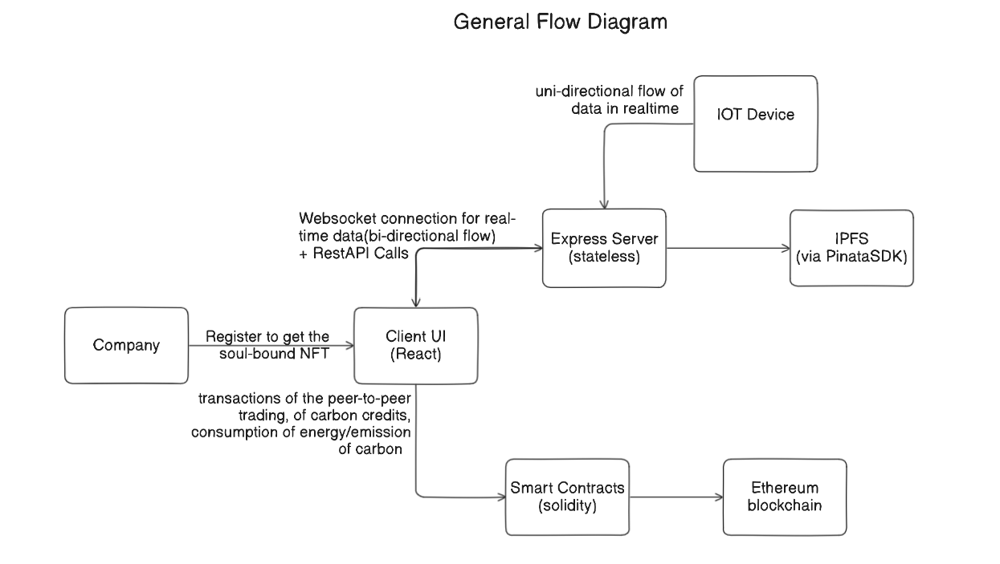
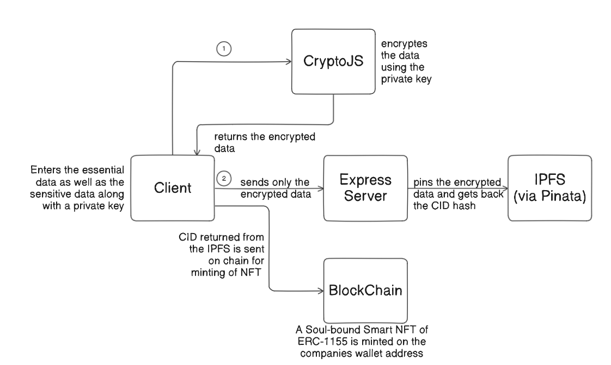
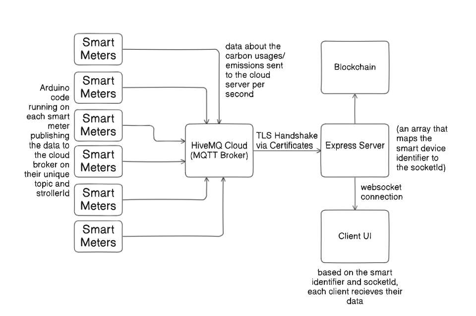
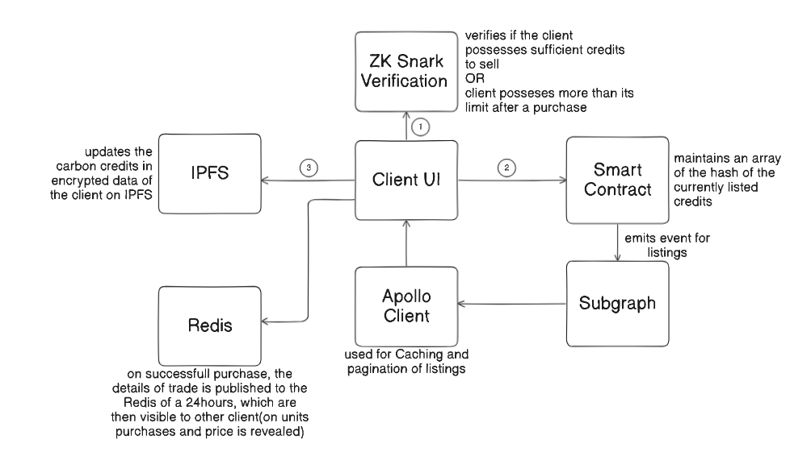

# General Flow of the Platform

# Company Documents Verification  

Users register through the **admin dashboard** and upload the required documents. These documents are **automatically submitted** to the government for verification. Upon successful verification, users receive a **notification** confirming their registration approval, granting them access to the platform with **verified credentials**. The system ensures a **secure and automated** approval workflow.  

# Decentralized Company Registration and Verification Protocol

This report outlines the development and workflow of a decentralized company registration platform that utilizes CryptoJS for encryption, IPFS for decentralized storage, and NFTs for identity verification. The platform ensures secure storage and retrieval of company data while leveraging blockchain technology for transparency and authentication. 

## Workflow of the Platform

### 1. Company Registration Process

When a company registers on the platform, the following steps are followed:

#### 1.1 Data Entry

- The company enters it's general data including sensitive data like production amount , smart meters identifiers and annual power consumption along with a private key that is stored no where.

#### 1.2 Encryption

- The company’s details are encrypted using **CryptoJS** (AES encryption) with the Private key to enhance security.
- This prevents unauthorized access to sensitive information.

#### 1.3 Decentralized Storage (IPFS - InterPlanetary File System)

- The encrypted data is stored on **IPFS**, a decentralized alternative to traditional databases.
- The platform retrieves a unique **CID** (Content Identifier) for the stored data.

#### 1.4 NFT Generation & Metadata Storage

- An ERC-1155 **Smart NFT** (Non-Fungible Token) is minted on the blockchain in the user address. 
- The **NFT metadata** contains the following:
  - Company’s encrypted data hash (**IPFS CID**)
  - Unique NFT ID that is the tokenID.
- The Smart NFT is made non-transferable ensuring it is not mistakenly transfered to someone else.
- **No Sensitive Data** is stored On Chain.

### 2. Company Login & Verification

At the time of login, the platform verifies the company’s identity using the NFT metadata.

#### 2.1 Fetching Data from NFT Metadata

- The system retrieves the **IPFS CID** from the NFT metadata.
- It fetches the encrypted company data from **IPFS**.

#### 2.2 Decryption

- The encrypted data is decrypted using the same **CryptoJS AES key** that was used during encryption.

#### 2.3 Authentication

- If the decrypted data matches and is parsed properly, the company successfully logs in.
- If not, access is denied.

## Conclusion

This decentralized platform ensures secure registration and verification processes through the integration of CryptoJS, IPFS, and NFTs. By utilizing blockchain technology, the system maintains transparency, security, and ease of access for both registration and login.

---

# IoT-Smart Grid Integration

## Overview

The IoT-Smart Grid integration platform enables secure, transparent, and decentralized monitoring of energy consumption and production in industrial settings. The platform integrates multiple smart devices across industries, collects real-time consumption data, and commits it to an immutable blockchain ledger, ensuring transparency and security.

## System Components and Workflow

1. **Smart Device Setup**
   - Each company can have multiple smart devices installed in their industries.
   - Every smart device has a unique identifier of the format **XXXX_ZZZZ**:
     - **XXXX**: Abbreviation of the company's sector (based on the 52 sectors defined by the EU).
     - **ZZZZ**: A unique numerical identifier for each device.

2. **Data Collection via MQTT Broker**
   - Each smart device sends real-time consumption data (measured every second) to an **MQTT Broker** (HiveMQ).
   - The broker acts as a data stream intermediary between the devices and the server.

3. **Data Transmission and Real-Time Updates**
   - The MQTT Broker streams the consumption data to an **Express server** via a **TLS Certificate** for secure communication.
   - The Express server then emits the consumption/production data along with the device identifier via **WebSockets** to the client-side application in real time.
   - Clients listen to these emitted data streams based on their device identifiers for real-time updates.

4. **Blockchain Commitment**
   - The Express server commits the most recent consumption data to the **blockchain** on a daily basis.
   - This ensures that the data is immutable, auditable, and accessible in a decentralized manner.

5. **Security and Privacy**
   - The identity of the company owning each smart device is not revealed in the data flow pipeline, ensuring enhanced privacy and security.
   - This approach prevents any leakage of proprietary or ownership information.

6. **Transparency and Decentralization**
   - The commitment of daily consumption data to the blockchain ensures complete transparency of the grid’s energy usage.
   - The decentralized nature of the platform ensures that the grid is tamper-proof and auditable by any authorized party.

## Conclusion

This IoT-Smart Grid integration platform provides a secure, transparent, and decentralized solution for monitoring energy consumption in industrial settings. By combining MQTT, WebSockets, and blockchain technology, the platform ensures real-time updates, data immutability, and enhanced security while maintaining privacy for the companies involved.

---

# Peer-to-Peer Carbon Credit Trading

## Overview

The Peer-to-Peer (P2P) Carbon Credit Trading system enables companies to securely list and purchase carbon credits while maintaining privacy and preventing market monopolization. The platform utilizes **ZK-SNARKs** for confidential verification, **on-chain event emissions** for transparency, and **The Graph** for efficient querying.

## Workflow

### 1. Listing Carbon Credits
- A company initiates a request to list a certain number of carbon credits for sale.
- Before the listing is approved, the system verifies whether the listed credits **do not exceed** the company’s current balance.
- This verification is performed using **ZK-SNARKs**, ensuring that:
  - The company's **carbon credit balance remains private**.
  - Only **proofs and public signals** are exposed for verification.
- Upon successful verification, the credits are added to the **on-chain listings**.
- An **event is emitted** containing the following parameters:
  - `listId`
  - `units` (number of credits)
  - `pricePerCredit`
  - `totalPrice`
- **No sensitive information (such as the company’s address) is emitted**.
- A **Subgraph** is deployed to consistently listen to this event for indexing and querying.

### 2. Purchasing Carbon Credits
- When a company attempts to purchase carbon credits, a similar verification process is conducted using **ZK-SNARKs**.
- The system ensures that **post-purchase**, the company’s total holdings **do not exceed** **1.5x** the carbon credit limit allocated at the beginning of the month.
- This prevents **hoarding** and **monopolization** of credits in the market.
- Since the **price per credit is constant**, the system prevents any speculative profiting opportunities.
- Upon a successful purchase, an **event is emitted** containing:
  - `listId`
- This event is also **indexed by the Subgraph** for efficient querying.

### 3. On-Chain Querying & UI Integration
- The **Subgraph** enables efficient GraphQL-based on-chain queries to retrieve active listings (i.e., those not yet purchased).
- The client-side **marketplace UI** fetches these active listings and displays them dynamically.
- The **Apollo Client** is used to interact with The Graph, allowing:
  - **Memory caching** for performance optimization.
  - **Pagination** for seamless data handling.

### 4. Off-Chain caching of recent Trades
- Once a trade is successfully, the trade details(except any details of client) is published on redis using socketIO which is then visible to other clients for 24hours
- Redis decouples the client, thus preventing the exposure of even the IP address of the clients to other clients.

## Conclusion

The **P2P Carbon Credit Trading system** ensures a **transparent, decentralized, and privacy-preserving** marketplace for carbon credits. By integrating **ZK-SNARKs**, **on-chain event emissions**, and **The Graph**, the platform guarantees **secure transactions**, **prevents monopolization**, and **enhances query efficiency** for a seamless user experience.

---
